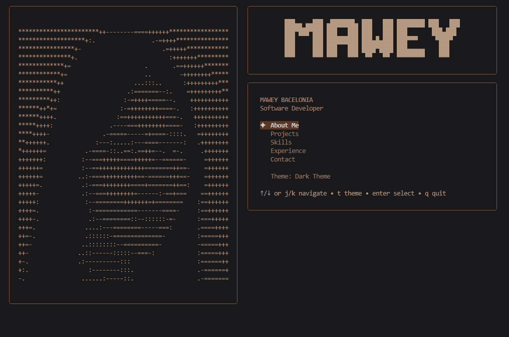

<div align="center">

# ✦ Mawey Bacelonia — SSH Portfolio

**A terminal-based portfolio built with Go, Bubble Tea, and Lip Gloss.**

Instead of a traditional web portfolio, this project explores building an
interactive portfolio experience directly in the terminal.





[](https://go.dev)
[](https://github.com/charmbracelet/bubbletea)
[](https://github.com/charmbracelet/lipgloss)
[](https://www.docker.com)
[](#)

</div>

## ✦ Features

| | |
|---|---|
| 🧭 | Interactive terminal navigation |
| 📐 | Responsive layouts for different terminal sizes |
| 🖼️ | ASCII portrait with dark / light variants |
| ⌨️ | Full keyboard navigation |
| ✉️ | Contact page |
| 🐳 | Dockerized application |

<br>

## 🛠 Built With

<div align="left">


</div>

<br>

## 🚀 Running Locally

**Clone the repository**

```bash
git clone https://github.com/MaweySB02/ssh-portfolio.git
cd ssh-portfolio
```

**Run with Go**

```bash
go run .
```

**Run with Docker Compose**

```bash
docker compose run --rm portfolio
```

<br>

## 🎨 Controls

| Key | Action |
|:---:|---|
| `↑` / `↓` | Navigate |
| `j` / `k` | Navigate |
| `Enter` | Select |
| `Esc` / `Backspace` | Return to menu |
| `t` | Toggle ASCII portrait |
| `q` | Quit |

<br>

## 📐 Responsive Layout

The portfolio adapts its layout based on terminal width:

| Width | Layout |
|---|---|
| `120+` columns | Full layout |
| `80–119` columns | Stacked layout |
| `< 80` columns | Compact layout |

<br>

## 📁 Project Structure

```
ssh-portfolio/
├── main.go
├── Dockerfile
├── docker-compose.yml
├── .dockerignore
├── go.mod
├── go.sum
└── .gitignore
```

<br>

## 👤 About

<div align="center">

Built by **Mawey Bacelonia**, a Software Developer interested in creating
software that feels creative and human.

</div>